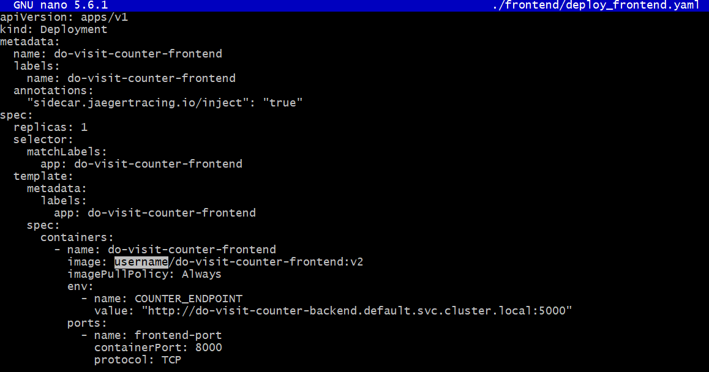
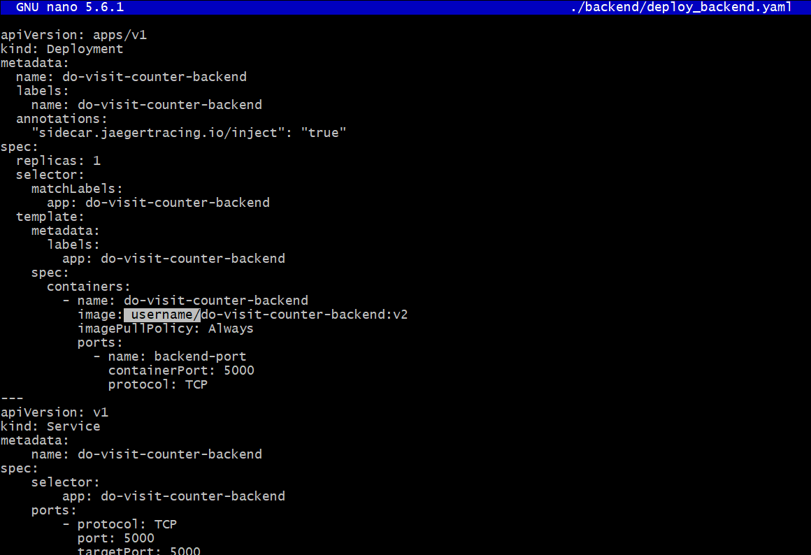
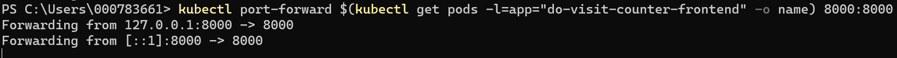
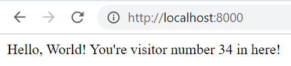
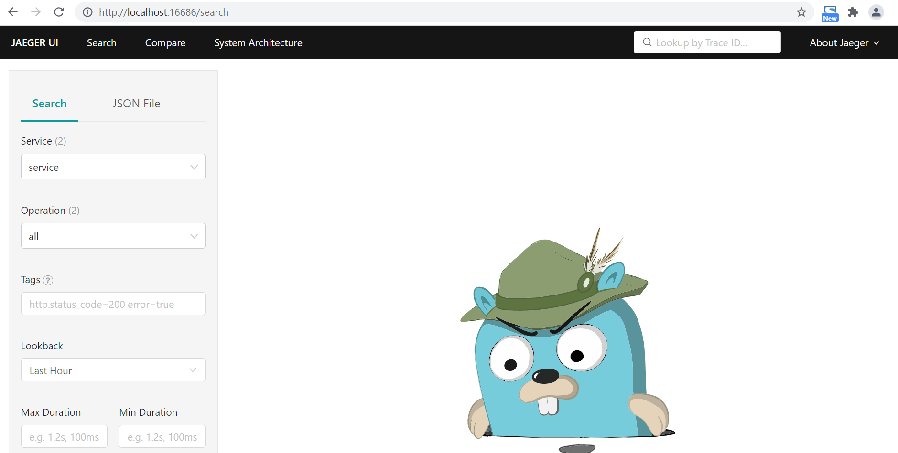
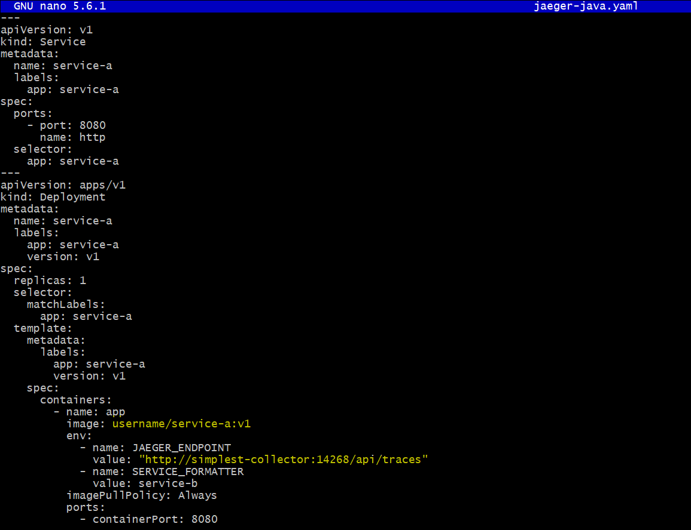
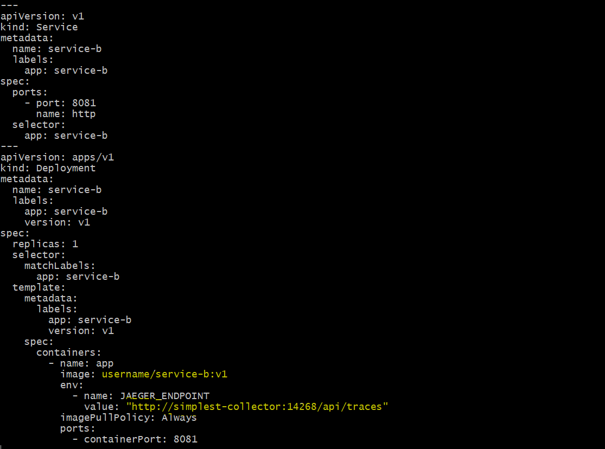
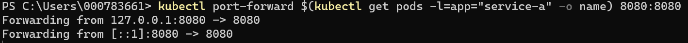
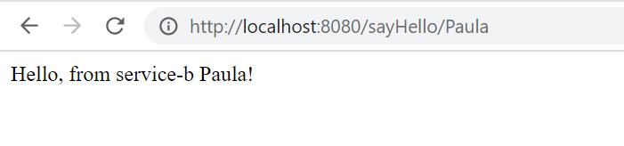
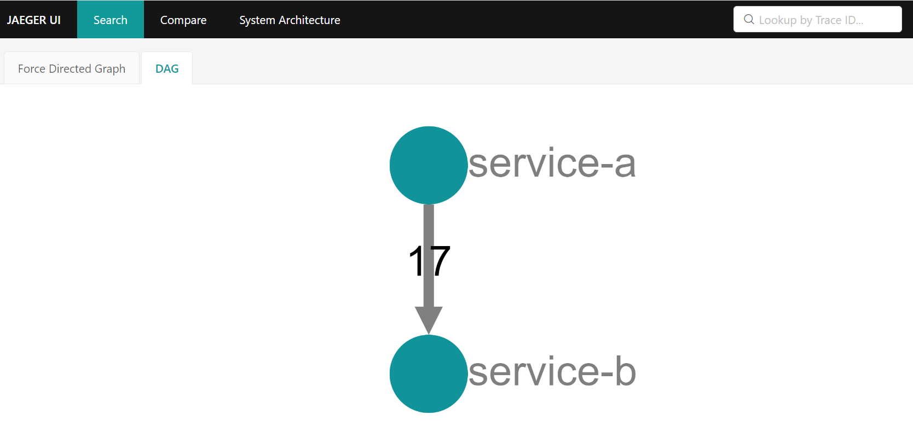

# Kubernetes-Jaeger-Monitoreo :tophat:
Jaeger es un sistema de software open source que sirve para detectar operaciones entre los servicios distribuidos. Se utiliza para supervisar entornos complejos de microservicios y solucionar los problemas asociados a ellos. 
<br />

## Tabla de contenido 📑

1. [Requisitos](#Requisitos-newspaper)
2. [Instalación del operador de Jaeger](#Instalación-del-operador-de-Jaeger)
3. [Implementación y monitoreo de una aplicación de prueba en Python](#Implementación-y-monitoreo-de-una-aplicación-de-prueba-en-Python)
4. [Implementación y monitoreo de una aplicación de prueba en Java - NodeJS](#Implementación-y-monitoreo-de-una-aplicación-de-prueba-en-Java---NodeJS)
5. [Referencias](#Referencias-mag)
6-.[Autores](#Autores-black_nib)

## Requisitos :newspaper:
- Tener un servicio **[Kubernetes Cluster (IKS)](https://cloud.ibm.com/kubernetes/clusters)** disponible en la cuenta IBM Cloud.

  **Importante:** Debe ser un Clúster **pago** en plan **Standard**, puede ser en infraestructura clásica o *VPC*.

- :cloud: [IBM Cloud CLI](https://cloud.ibm.com/docs/cli?topic=cloud-cli-getting-started&locale=en)
- :whale: [Docker](https://www.docker.com/products/docker-desktop)
- [kubectl](https://kubernetes.io/docs/tasks/tools/install-kubectl/). La version de esta herramienta debe ser compatible con la version de IKS que se desplegó en la cuenta.
- Complemento [container-service/kubernetes-service](https://cloud.ibm.com/docs/cli?topic=cli-install-devtools-manually) para ibmcloud CLI. `ibmcloud plugin install container-service/kubernetes-service`.
- Tener instalado git.

## Instalación del operador de Jaeger

Para trabaja Jaeger en un ambiente de producción, lo más recomendable es instalar el operador Jaeger, a continuación se detallan los pasos para instalar Jaeger en su clúster de Kubernetes, utilizando las plantillas utilizadas en la documentación oficial de Jaeger:

1.  Cree la definición de recurso personalizada requerida por el operador de Jaeger:

```
kubectl create -f https://raw.githubusercontent.com/jaegertracing/jaeger-operator/master/deploy/crds/jaegertracing.io_jaegers_crd.yaml
```
2. A continuación, cree una cuenta de servicio , un rol y una vinculación de roles para el control de acceso basado en roles:

```
kubectl create -f https://raw.githubusercontent.com/jaegertracing/jaeger-operator/master/deploy/service_account.yaml
kubectl create -f https://raw.githubusercontent.com/jaegertracing/jaeger-operator/master/deploy/role.yaml
kubectl create -f https://raw.githubusercontent.com/jaegertracing/jaeger-operator/master/deploy/role_binding.yaml
```
3. Finalmente, implemente el operador Jaeger:

```
kubectl create -f https://raw.githubusercontent.com/jaegertracing/jaeger-operator/master/deploy/operator.yaml
```
4. Aunque ya se tenga instalado el operador, es necesario crear un recurso que describa la instancia de Jaeger:

```
kubectl apply -f - <<EOF
apiVersion: jaegertracing.io/v1
kind: Jaeger
metadata:
  name: simplest
EOF
```
5. Para validar que Jaeger está funcionando correctamente, ejecute el siguiente comando y verifique si puede acceder a la interfaz de usuario:

```
kubectl port-forward $(kubectl get pods -l=app="jaeger" -o name) 16686:16686
```

 <p align=center></p>
 <br />
Por ahora el unico servicio que debe ver es el de Jaeger Query, ahora procederemos a implementar la aplicación que deseamos monitorear.
 

## Implementación y monitoreo de una aplicación de prueba en Python
Dicha aplicación ha sido copiada del siguiente [tutorial](https://www.digitalocean.com/community/tutorials/how-to-implement-distributed-tracing-with-jaeger-on-kubernetes) y consiste en una aplicación sencilla que será un contador de visitas cuyo valor aumenta cada vez que se realiza un llamado al frontend. Para simular problemas de rendimiento, incluye una función de suspensión aleatoria que se ejecuta cada vez que el frontend envía una GET solicitud al backend. Esta aplicación además incluye la configuración necesaria de OpenTracing que necesita Jaeger para monitorear la aplicación. A continuación se detallan los pasos para desplegar la aplicación en el clúster de Kubernetes:

1. Dirijase a la carpeta ```sammy-jaeger``` que se encuentra en la carpeta clonada de este repositorio. A continuación asegurese que haya iniciado sesión en DockerHub con el siguiente comando:

```
docker login --username=your_username --password=your_password
```
2. Ejecute 

```
nano ./frontend/deploy_frontend.yaml
```
O el comando que le permita editar el archivo. Cambie la dirección ```username``` por su usuario de docker.

 <p align=center></p>
 <br />
 
 Pulse Ctrl+S para guardar los cambios. Y Ctrl+X para salir del editor. 
 
 3. Ejecute 

```
nano ./backend/deploy_backend.yaml
```
O el comando que le permita editar el archivo. Cambie la dirección ```username``` por su usuario de docker.

 <p align=center></p>
 <br />
 
 4. A continuación se creará la imagen en Docker, ejecute los siguiente comandos:
(Recuerde cambiar username por su usuario de DockerHub)

Para crear el backend:
 
 ```
docker build -t username/do-visit-counter-backend:v2 ./backend
docker push username/do-visit-counter-backend:v2
 ```
Para crear el frontend:

```
docker build -t username/do-visit-counter-frontend:v2 ./frontend
docker push username/do-visit-counter-frontend:v2

```
 5. Ahora enviaremos la aplicación al clúster de kubernetes:
 
 ```
kubectl apply -f ./frontend/deploy_frontend.yaml
kubectl apply -f ./backend/deploy_backend.yaml

 ```
6. Para abrir la aplicación ejecute:

```
kubectl port-forward $(kubectl get pods -l=app="do-visit-counter-frontend" -o name) 8000:8000
```

 <p align=center></p>
 <br />
 
7. Abra la aplicación desde el browser con la dirección http://localhost:8000.

 <p align=center></p>
 <br />
 
En otra terminal no olvide estar corriendo la aplicación de Jaeger, abra la consola de Jaeger con la dirección http://localhost:16686. Debes poder visualizar el servicio ```service``` que corresponde a la aplicación desplegada.

 <p align=center></p>
 <br />

8. A continuación en otra terminal ejecute solicitudes a la aplicación para posteriormente observar el monitoreo.

```
for i in 0 1 2 3 4 5 6 7 8 9; do curl localhost:8000; done
```
9. Una vez concluido el ciclo del paso anterior, ingrese a la consola de Jaeger y complete lo siguiente:

* ```Service```: service
* ```Operation```: Puede escoger cualquiera de los servicio de la aplicación ```hello_world``` o ```counter```. O en este caso escogeremos la opción ```all``` para visualizar ambos servicios.
* ```Tags```: Esta opción le permite filtrar por la respuesta que fue entregada al cliente al momento de hacer la solicitud a la aplicación. Ejm: http.status_code=200.
* ```Lookback```: Puede elegir visualizar las solicitudes hechas en las útimas horas, según necesite puede elegir entre un rango de la última hora y las últimas 48 horas.
* ```Max Duration/Min Duration ```: Debido a que Jaeger le entrega el tiempo en que tardo la aplicación en responder a la solictud, usted puede filtrar entre los tiempos que haya tardado, que sean de su interes. 
* ```Limit Results```: Con esta opción indique a Jaeger cuantos resultados desea listar en el monitoreo que va a realizar.

Finalmente de click en ``` Find Traces``` para que se muestren los resultados. En el caso de la aplicación de ejemplo, usted podrá visualizar una primera gráfica donde se comparan las solicitudes realizadas de acuerdo a su tiempo de respuesta. Y posteriormente un resumen del tiempo y la respuesta de cada solicitud realizada por el cliente.

 <p align=center></p>
 <br />

## Implementación y monitoreo de una aplicación de prueba en Java - NodeJs
Dicha aplicación ha sido copiada del siguiente [tutorial](https://tracing.cloudnative101.dev/docs/ocp-jaeger.html) y consiste en una aplicación que consta de dos servicios (servicio-a y servicio-b), el servicio-a envia una petición de saludo al servicio-b el cual constesta el saludo con el parametro de nombre ingresado por el cliente al momentode realizar la solicitud al servicio-b, esta aplicación tambien incluye una función de suspensión que se ejecuta cada tres solicitudes realizadas al servicio-a. Esta aplicación además incluye la configuración necesaria de OpenTracing que necesita Jaeger para monitorear la aplicación. A continuación se detallan los pasos para desplegar la aplicación en el clúster de Kubernetes:

1. Dirijase a la carpeta ```lab-jaeger-java``` o  ```lab-jaeger-nodejs```, dependiendo de cual de las dos quiera ejecutar, que se encuentra en la carpeta clonada de este repositorio. A continuación asegurese que haya iniciado sesión en DockerHub con el siguiente comando:

```
docker login --username=your_username --password=your_password
```
2. Ejecute 

```
cd solution
```
 
 3. A continuación se creará la imagen en Docker, ejecute los siguiente comandos:
(Recuerde cambiar username por su usuario de DockerHub)

Para crear el servicio-a:
 
 ```
docker build -t username/service-a:v1 ./service-a
docker push username/service-a:v1
 ```
Para crear el servicio-b:

```
docker build -t username/service-b:v1 ./service-b
docker push username/service-b:v1

```

4. Regrese a la carpeta principal del proyecto y ejecute:

```
cd lab-jaeger-ocp
```
5. A continuación, ejecute el siguiente comando para editar el archivo de configuración ```jaeger-java.yaml``` o ```jaeger-nodejs.yaml```:

```
nano jaeger-nodejs.yaml
```
O el comando que le permita editar el archivo.

Una vez ingrese al archivo cambie el ```username``` por su usuario de DockerHub, agregue la extensión :v1 al nombre de la imagen y el ```value``` del ```JAEGER_ENDPOINT``` establezcalo en : "http://simplest-collector:14268/api/traces". Realice esto para el deployment de ambos servicios.

<p align=center></p>
 <br />

<p align=center></p>
 <br />

Pulse Ctrl+S para guardar los cambios. Y Ctrl+X para salir del editor. 

6. Ahora enviaremos la aplicación al clúster de kubernetes:
 
 ```
kubectl apply -f ./jaeger-nodejs.yaml

 ```
7. Para abrir la aplicación ejecute:

```
kubectl port-forward $(kubectl get pods -l=app="service-a" -o name) 8080:8080
```

 <p align=center></p>
 <br />
 
7. Abra la aplicación desde el browser con la dirección http://localhost:8080/sayHello/nombre.

 <p align=center></p>
 <br />
 
En otra terminal no olvide estar corriendo la aplicación de Jaeger, abra la consola de Jaeger con la dirección http://localhost:16686. Debes poder visualizar el servicio ```service-a``` y ```service-b``` que corresponde a la aplicación desplegada. Elija visualizar ```service-a``` y evidencie la traza correspondiente a la solicitud que realizo previamente, observando su comunicación con el servicio-b, el tiempo de respuesta y tipo de solicitud realizada.
 
 <p align=center></p>
 <br />


8. A continuación ejecute una solicitud de error:
```
 curl http://localhost:8080/error -I HTTP/1.1 500
```
 Y visualice la traza en Jaeger.
 
 <p align=center></p>
 <br /> 

 
 
9. Ejecute el siguiente ciclo para enviar varias solicitudes a la aplicación:

```
for i in 0 1 2 3 4 5 6 7 8 9; do curl localhost:8080/sayHello/<nombre>; done
```
Una vez concluido el ciclo anterior, ingrese a la consola de Jaeger y visualice las distintas trazas, con el tiempo de respuesta y detalle.

 <p align=center></p>
 <br />

 10. Finalmente en la consola de Jaeger, ingrese a System Architecure > DAG y visualice la arquitectura de la aplicación.
 
 <p align=center></p>
 <br />
 
 ## Referencias :mag:

- [Documentación Kiali](https://istio.io/docs/tasks/observability/kiali/)


<br />

## Autores :black_nib:
Equipo *IBM Cloud Tech Sales Colombia*.

